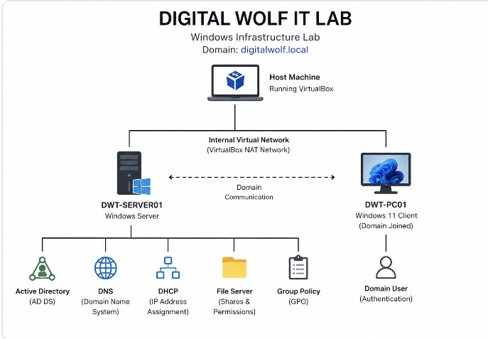

# Digital Wolf IT Infrastructure & Help Desk Lab

## Project Overview

I designed and deployed a virtualized IT infrastructure lab to simulate a small business environment.
 
The project was built to develop hands-on experience with Windows Server administration, Active Directory, DNS, DHCP, Group Policy, file services, networking, and IT Help Desk troubleshooting.

## Environment

| System | Role |
|---|---|
| DWT-SERVER01 | Windows Server infrastructure |
| DWT-PC01 | Windows 11 domain-joined workstation |
| VirtualBox | Virtualization platform |

## Technologies & Skills

- Windows Server
- Windows 11
- Active Directory Domain Services
- DNS
- DHCP
- Group Policy
- NTFS & Share Permissions
- Active Directory Users & Groups
- Domain-joined workstation management
- Windows networking
- Help Desk troubleshooting
- Break/Fix troubleshooting
- VirtualBox

## Project Components

### 1. Architecture
Designed a virtualized network environment connecting a Windows Server infrastructure system with a domain-joined Windows 11 workstation.

### 2. Windows Server
Installed and configured Windows Server and prepared the environment for centralized infrastructure services.

### 3. Active Directory
Created the `digitalwolf.local` domain and configured organizational units, users, security groups, and group memberships.

### 4. DNS & DHCP
Configured DNS for domain name resolution and DHCP for automated IP address assignment.

### 5. Group Policy
Created and tested Group Policy settings to manage workstation configuration and security.

### 6. Windows Client
Configured a Windows 11 workstation, joined it to the domain, and tested domain authentication.

### 7. File Server
Created departmental shared folders and configured Share and NTFS permissions using Active Directory security groups.

### 8. Help Desk & Troubleshooting
Created simulated IT support incidents and practiced a complete troubleshooting workflow:

**Identify → Investigate → Diagnose → Resolve → Verify → Document**

## Help Desk Tickets

| Ticket | Issue | Skills Demonstrated |
|---|---|---|
| DW-001 | DHCP / incorrect network configuration | DHCP, IP troubleshooting |
| DW-002 | DNS resolution failure | DNS, name resolution |
| DW-003 | Shared folder access denied | NTFS, Share Permissions, AD Groups |
| DW-004 | Domain login failure | Active Directory authentication |

## Key Takeaways

This project strengthened my ability to troubleshoot technical problems systematically and document the resolution.

It also gave me hands-on experience working with common technologies used in entry-level IT Help Desk and Junior Systems Administrator environments.

## Future Improvements

- Microsoft 365 administration
- VLAN configuration
- PowerShell automation
- Remote administration
- Monitoring and logging
- Expanded ticketing workflows
