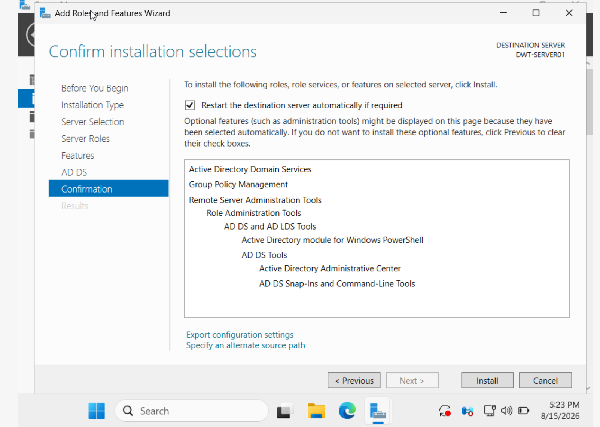
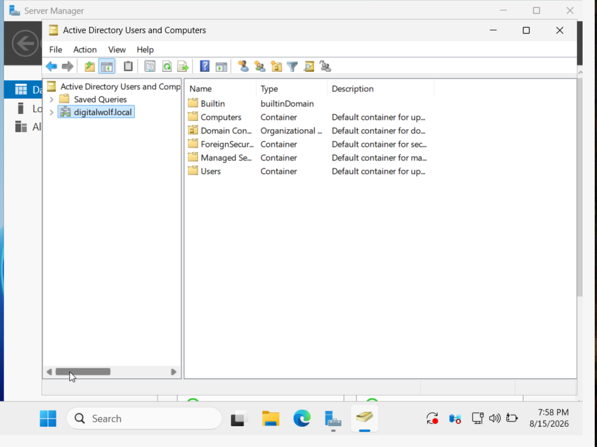
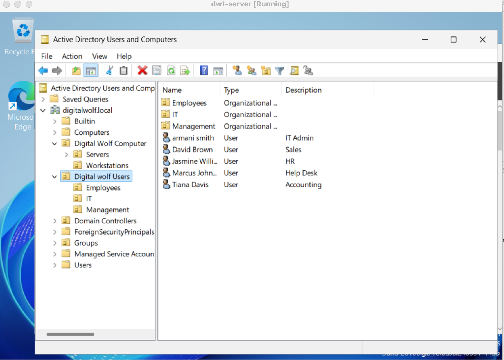
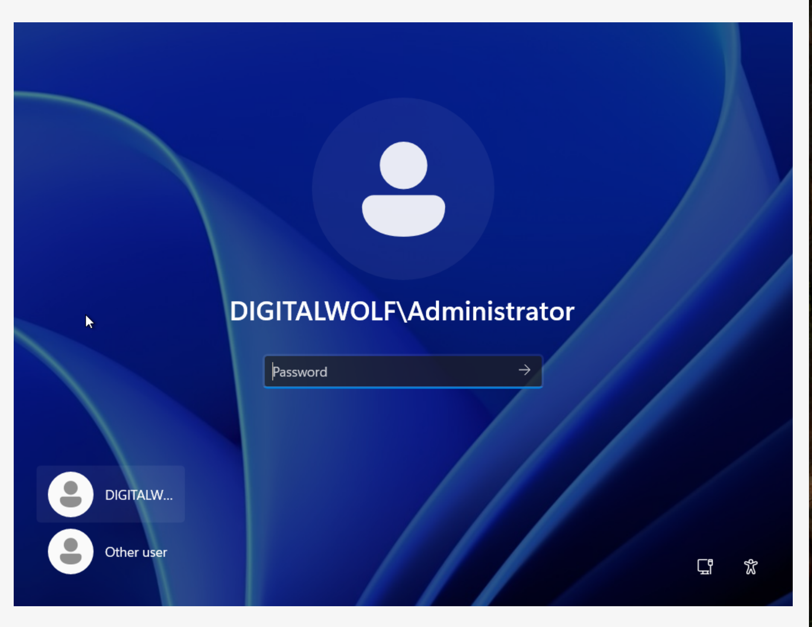

# Active Directory

## Overview

Configured Active Directory Domain Services (AD DS) to provide centralized identity and access management for the Digital Wolf IT lab.

## Domain

**Domain:** `digitalwolf.local`

## Organizational Units

Created organizational units to organize users and support different departments:

- Accounting
- Employees
- HR
- IT-Admins
- IT Help Desk
- Sales

## Users & Security Groups

Created test user accounts and security groups to simulate a small business environment.

Security groups were used to organize users and control access to resources.

## Skills Demonstrated

- Active Directory administration
- User account management
- Organizational Unit (OU) management
- Security group management
- Group membership
- Domain authentication
- Centralized identity management

## Evidence

## Evidence

### 1. Active Directory Domain Services Installation

Installed the Active Directory Domain Services role on Windows Server to prepare the environment for centralized identity management.

### 2. Digital Wolf Domain

Configured the `digitalwolf.local` domain for the lab environment.

### 3. Organizational Units

Created organizational units to organize users by department and administrative function.

### 4. Users & Security Groups

Created user accounts and security groups to simulate organizational access management.

### 5. Domain Authentication

Verified that a Windows client could authenticate using a domain account.

