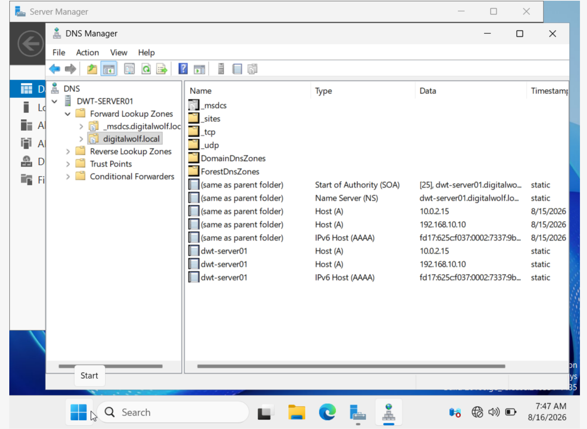
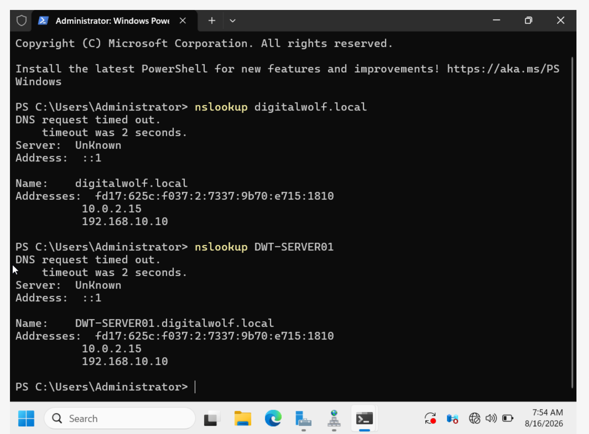
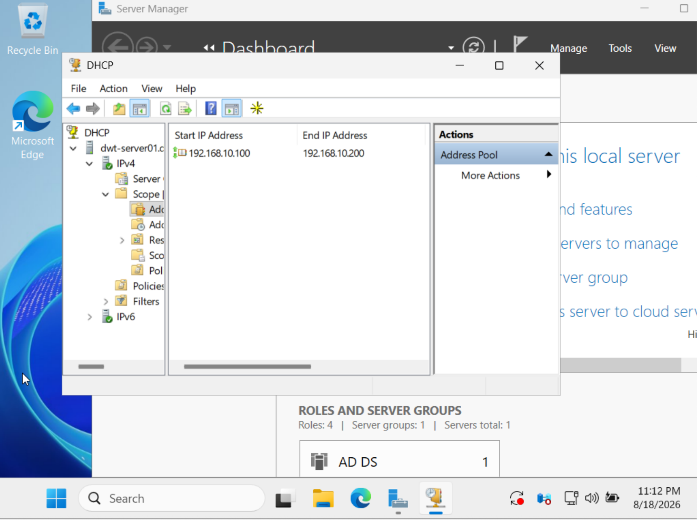
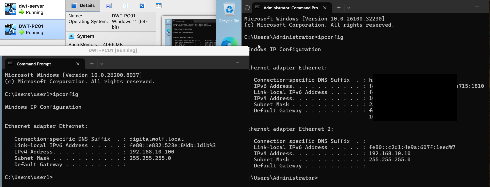
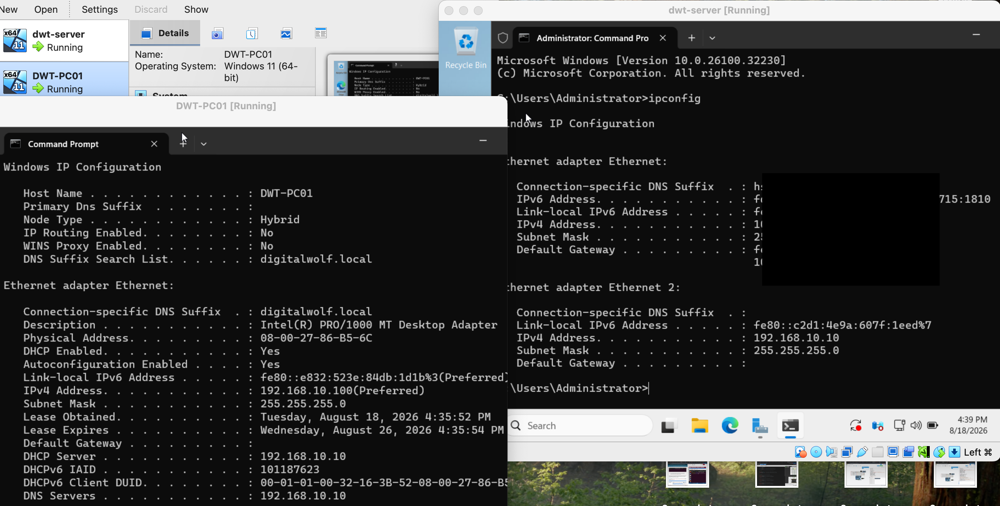

# DNS & DHCP

## Overview

Configured DNS and DHCP services on Windows Server to provide name resolution and automatic network configuration for the Digital Wolf domain environment.

## DNS

Configured DNS for the `digitalwolf.local` domain and verified that domain names could be resolved by the Windows client.

## DHCP

Configured a DHCP scope to automatically assign network addresses to client systems and verified that the client received a lease.

## Skills Demonstrated

- DNS configuration
- DNS name resolution
- DHCP scope configuration
- DHCP lease management
- IP address assignment
- Network troubleshooting
- `nslookup`
- `ipconfig`

## Evidence

### 1. Digital Wolf DNS Zone

Configured the DNS zone for the `digitalwolf.local` domain.

### 2. DNS Resolution Test

Tested DNS resolution to verify that domain names could be resolved successfully.

### 3. DHCP Scope

Configured the DHCP scope used to provide IP addresses to client systems.

### 4. DHCP Client Lease

Verified that the Windows client successfully received a DHCP lease.

### 5. Client Network & DNS Test

Verified client network connectivity and DNS configuration.

