# File Server & Permissions

## Overview

Configured a Windows file server environment to simulate departmental shared resources and access control within the Digital Wolf domain.

## File Structure

Created a company file structure with separate shared resources for different departments and user groups.

## Share & NTFS Permissions

Configured Share permissions and NTFS Security permissions to control access to departmental resources.

Active Directory security groups were used to manage access to specific shared folders.

## Access Testing

Tested access from the Windows client using different user accounts and security groups to verify that the configured permissions worked as intended.

### Skills Demonstrated

* Windows file server administration
* Shared folder configuration
* Share permissions
* NTFS permissions
* Active Directory security groups
* Access control
* Permission troubleshooting
* User access testing
* File server security

## Evidence

## Evidence

### 1. Company File Structure

Created the company file structure used to organize departmental shared resources.

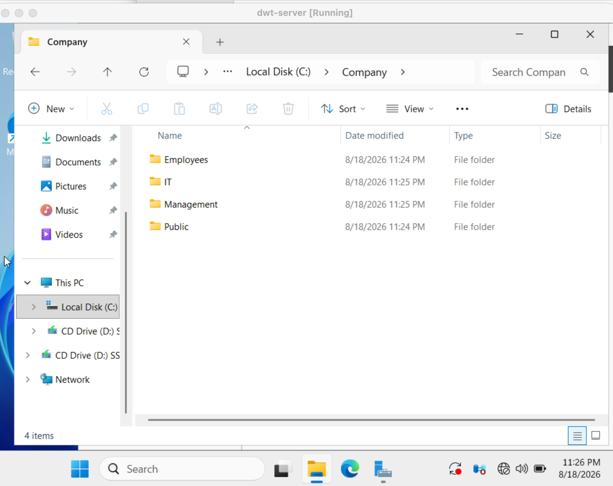

### 2. Public Share Permissions

Configured Share permissions for the Public shared resource.

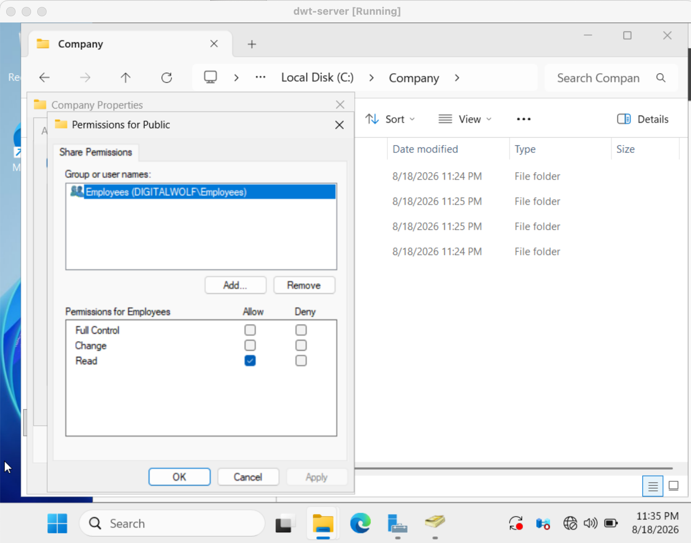

### 3. Public NTFS Permissions

Configured NTFS Security permissions for the Public shared resource.

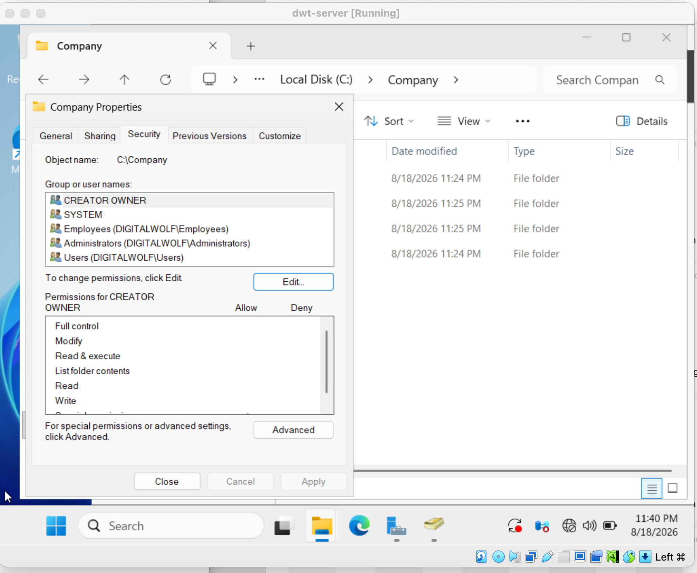

### 4. Public Share Test

Tested access to the Public share from the Windows client.

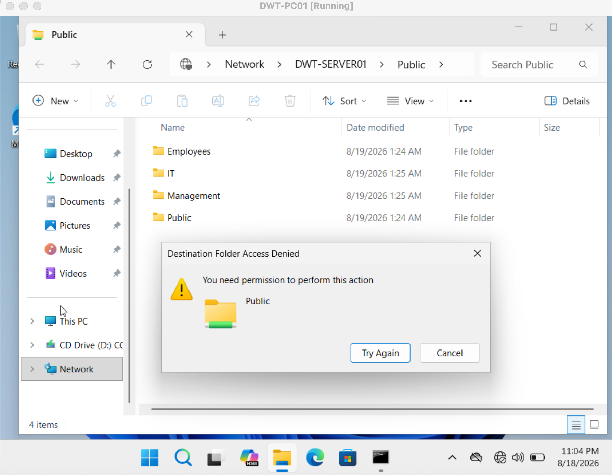

### 5. IT Share Permissions

Configured Share permissions for the IT shared resource.

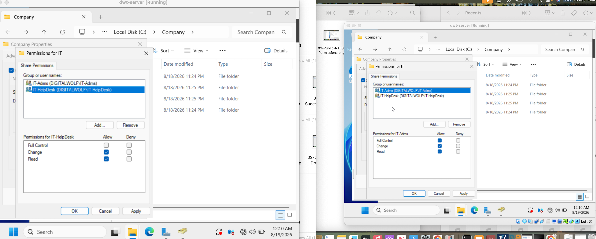

### 6. IT NTFS Permissions

Configured NTFS Security permissions for the IT shared resource.

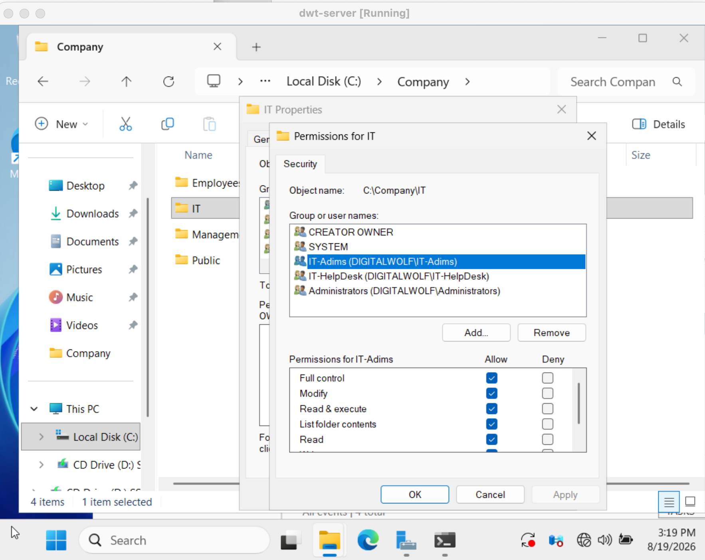

### 7. IT Help Desk Access Test

Tested access to the IT shared resource using an IT Help Desk account.

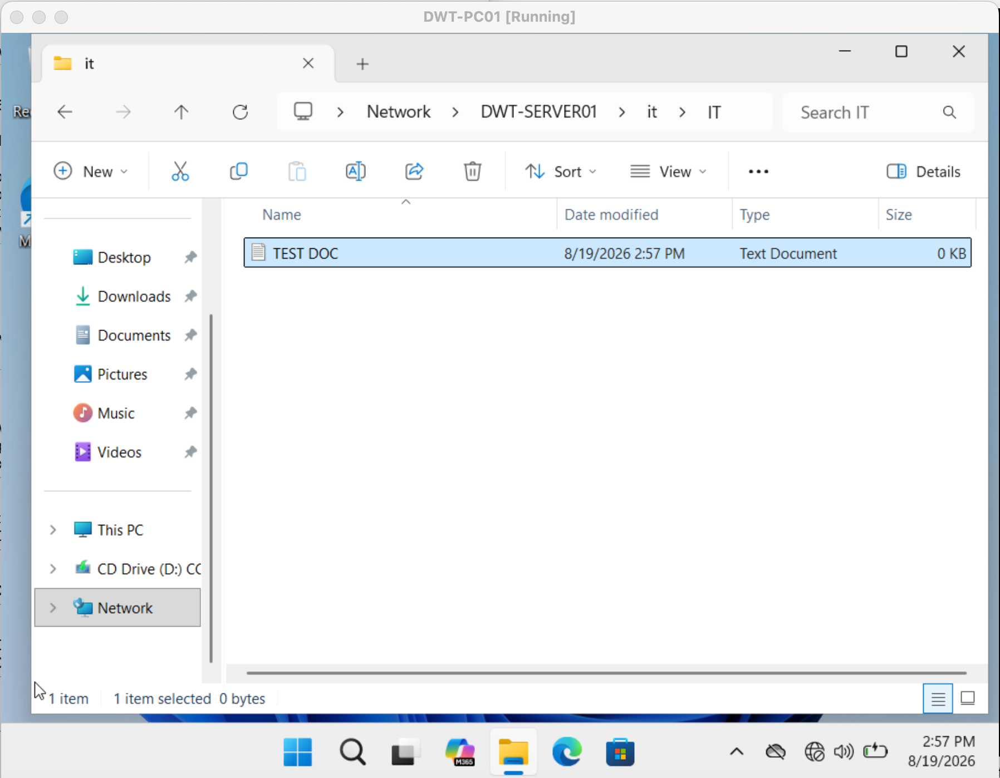

### 8. IT Admins Access Test

Tested access to the IT shared resource using an IT Admins account.

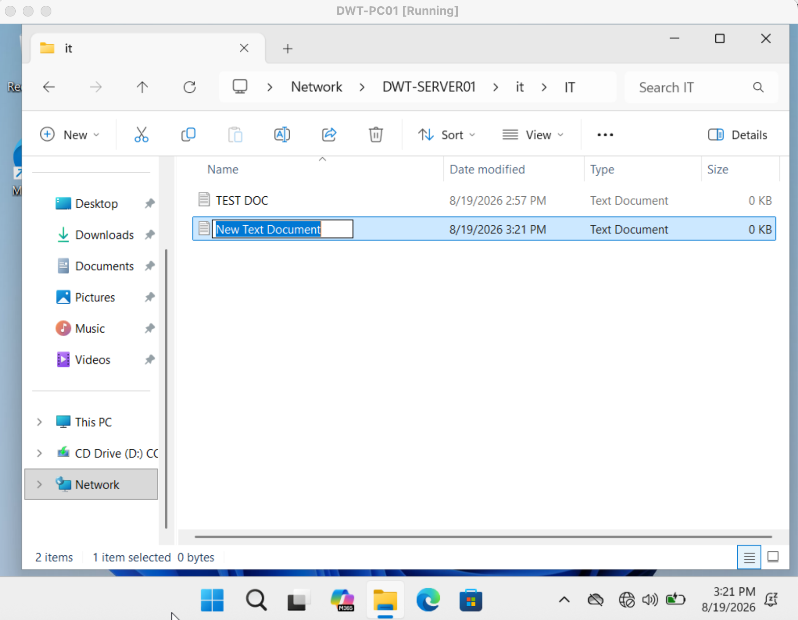

### 9. Employees Share Permissions

Configured Share permissions for the Employees shared resource.

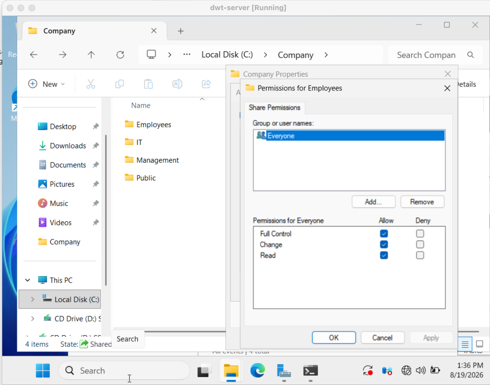

### 10. Employees NTFS Permissions

Configured NTFS Security permissions for the Employees shared resource.

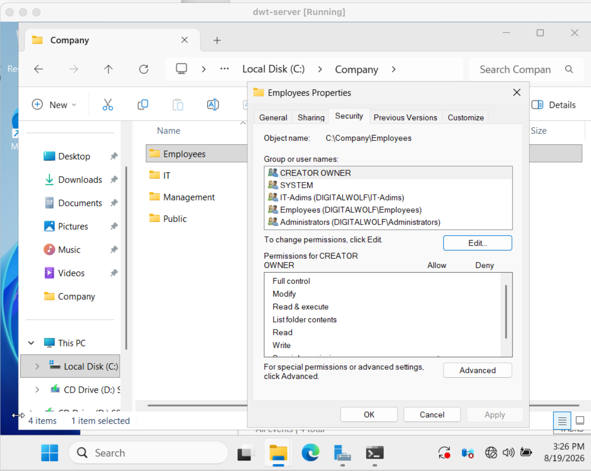

### 11. Employees Share Test

Tested access to the Employees shared resource from the Windows client.

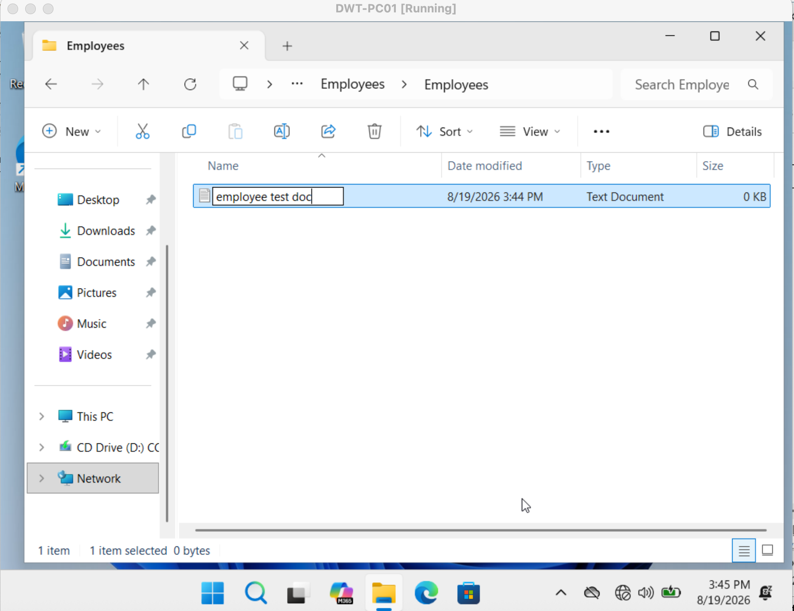

### 12. Management Share Permissions

Configured Share permissions for the Management shared resource.

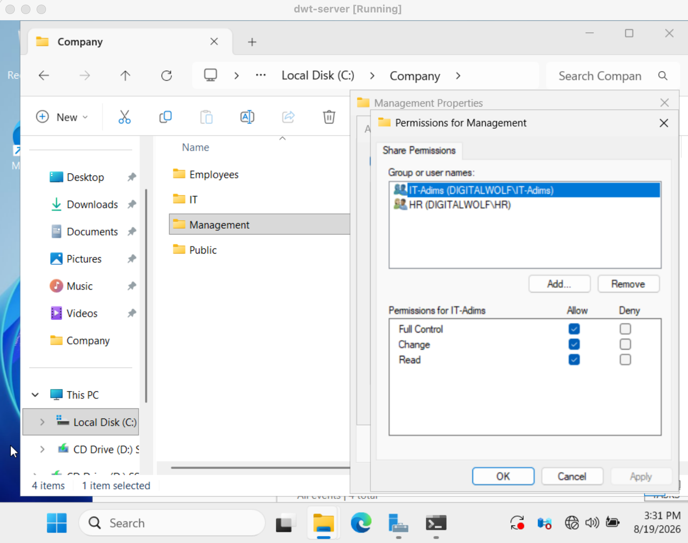

### 13. Management NTFS Permissions

Configured NTFS Security permissions for the Management shared resource.

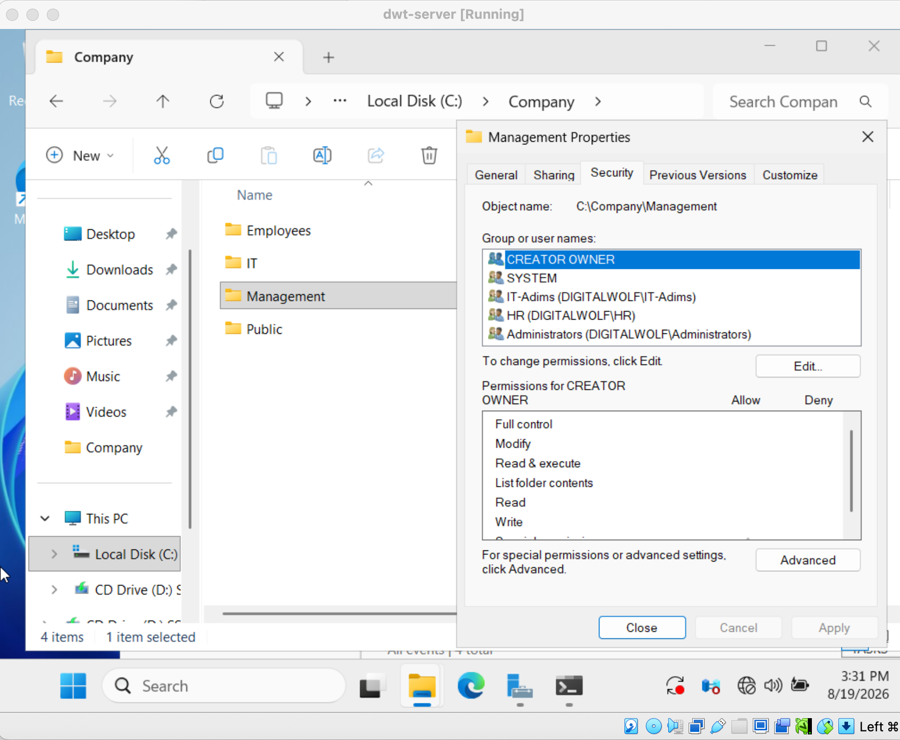
