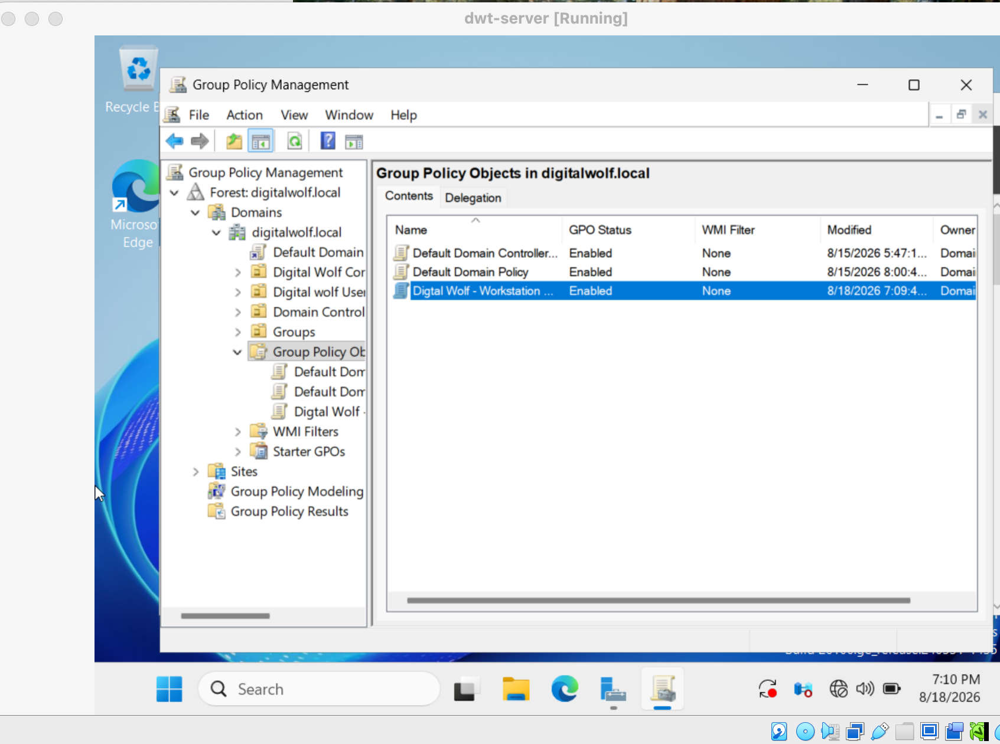
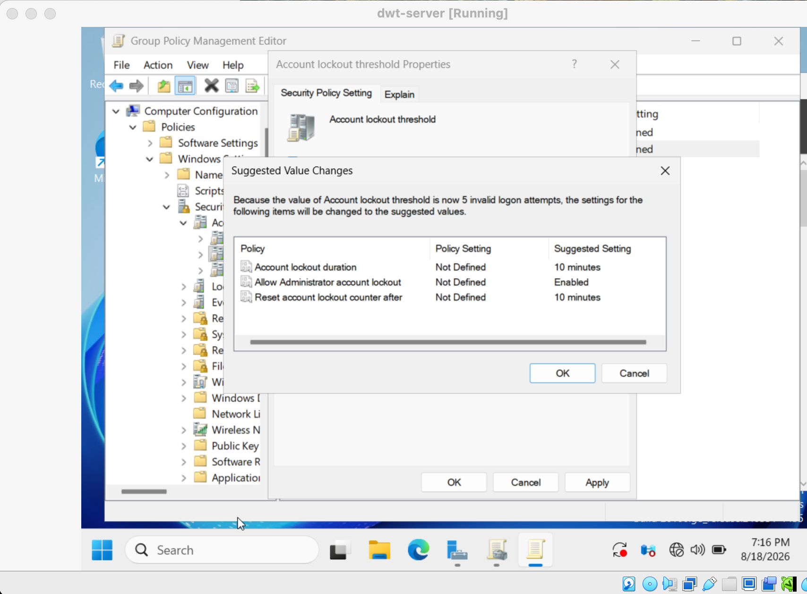
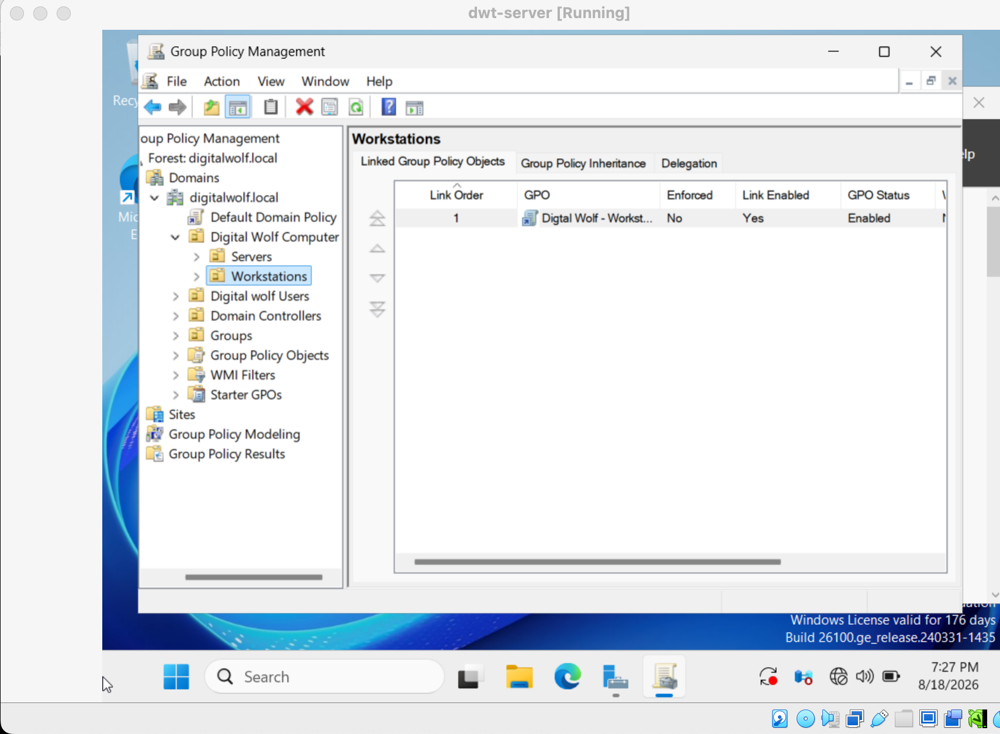
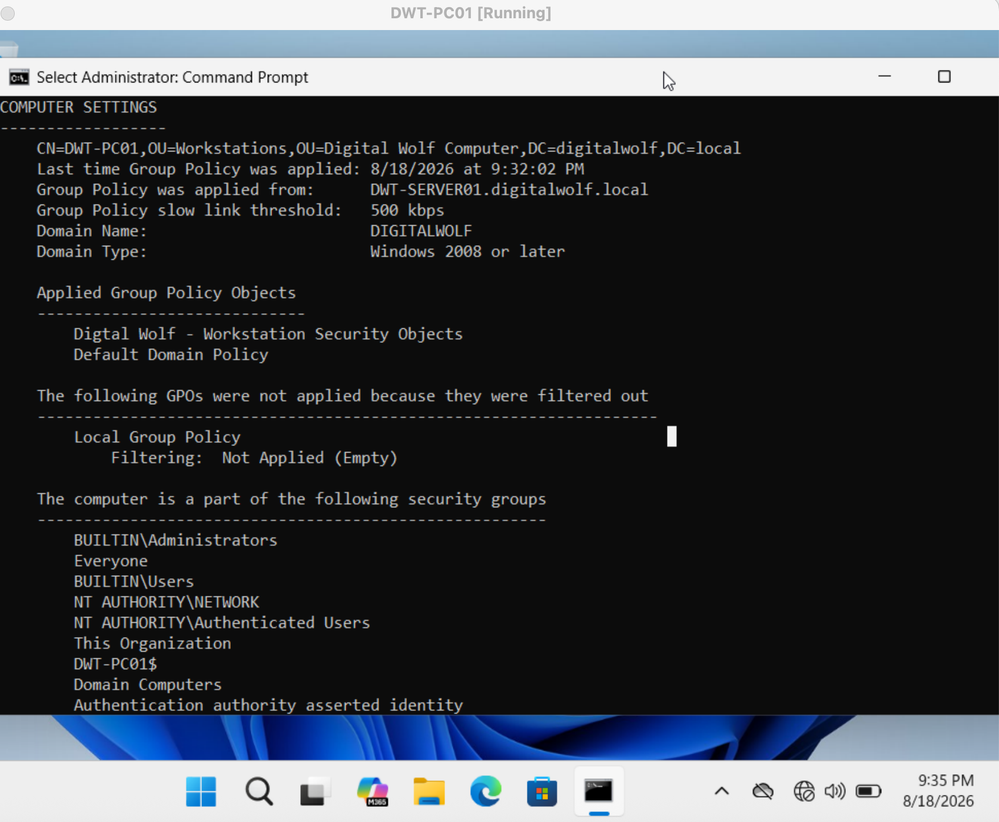

# Group Policy
## Overview
Configured and tested Group Policy to manage workstation security and system settings within the digitalwolf.local domain.
## Policies Configured
* Workstation security settings
* Password policy
* Account lockout policy
* Computer configuration settings
## GPO Deployment
Created a security Group Policy Object, linked it to the appropriate workstation organizational unit, and verified that the policy was successfully applied to the Windows client.
### Skills Demonstrated
* Group Policy Management
* GPO creation and configuration
* GPO linking
* Password policy configuration
* Account lockout configuration
* Group Policy troubleshooting
* gpupdate
* gpresult
## Evidence
### 1. Workstation Security GPO
Configured the Workstation Security GPO to manage security settings on the domain-joined workstation.

### 2. Password & Lockout Policy
Configured password and account lockout settings through Group Policy.

### 3. GPO Linked to Workstations
Linked the security GPO to the appropriate workstation organizational unit.

### 4. GPO Successfully Applied
Verified that the Group Policy was successfully applied to the Windows client.

