# Help Desk & Troubleshooting

## Overview

Created and resolved simulated IT Help Desk tickets based on issues encountered within the Digital Wolf IT lab.

The tickets were documented using a structured troubleshooting process:

**Identify → Investigate → Diagnose → Resolve → Verify → Document**

## Troubleshooting Skills Demonstrated

- DHCP troubleshooting
- DNS troubleshooting
- Network configuration
- IP address troubleshooting
- File and share permissions
- NTFS permissions
- Active Directory
- Domain authentication
- User access troubleshooting
- Break/Fix troubleshooting
- Technical documentation

## Ticket Summary

| Ticket | Issue | Resolution |
|---|---|---|
| DW-001 | DHCP / network configuration issue | Corrected network configuration and verified connectivity |
| DW-002 | DNS / name resolution issue | Corrected DNS configuration and verified resolution |
| DW-003 | User access denied to shared resource | Corrected share and NTFS permissions |
| DW-004 | Domain login failure | Verified account and corrected authentication issue |

## Evidence

### DW-001 — DHCP / Network Configuration

Investigated a client network configuration issue by comparing the incorrect network settings with the corrected configuration.

#### Before

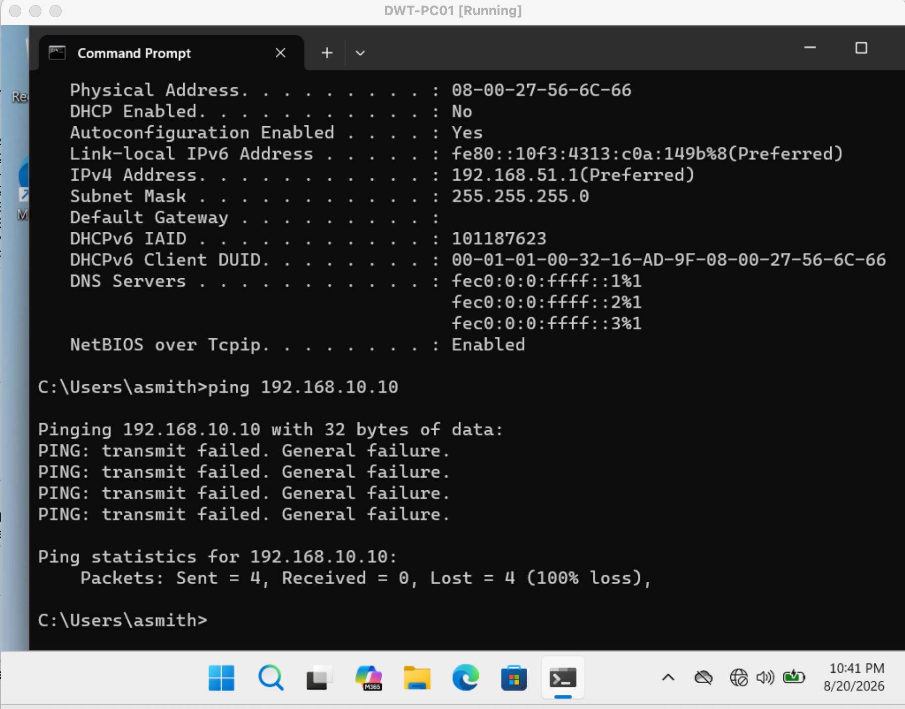

#### After

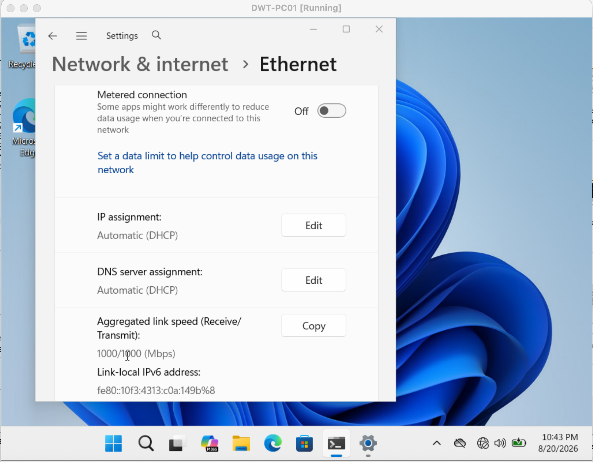

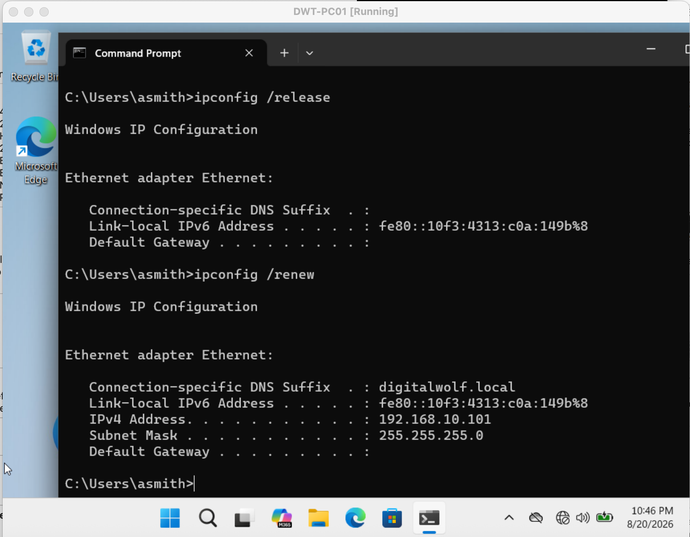

---

### DW-002 — DNS / Name Resolution

Troubleshot a DNS-related issue by examining the client's network configuration and correcting the DNS settings.

#### Before

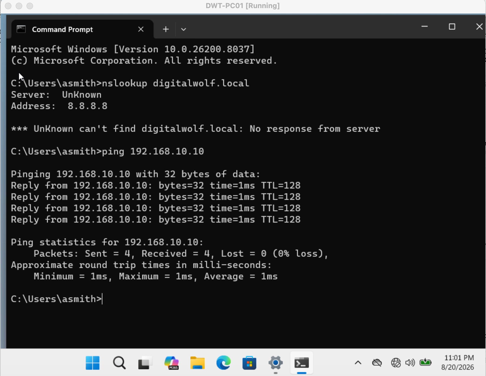

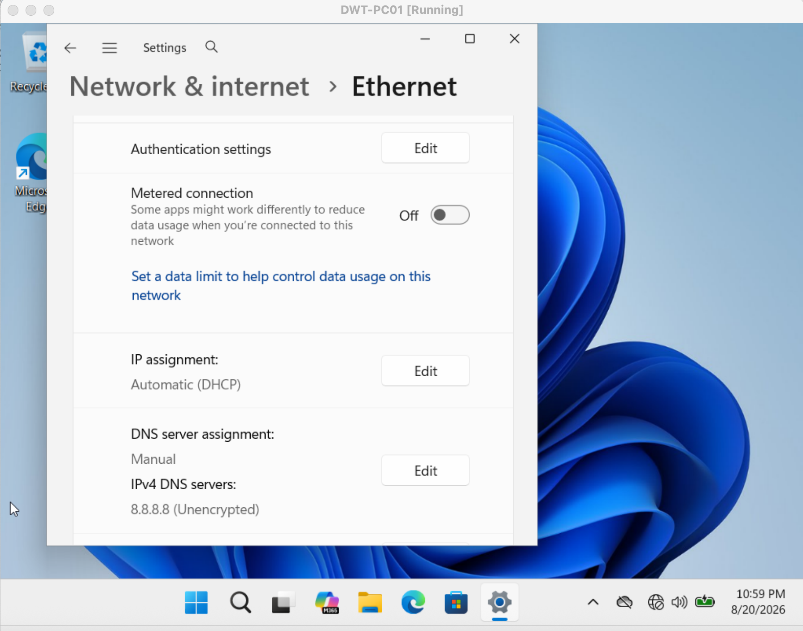

#### After

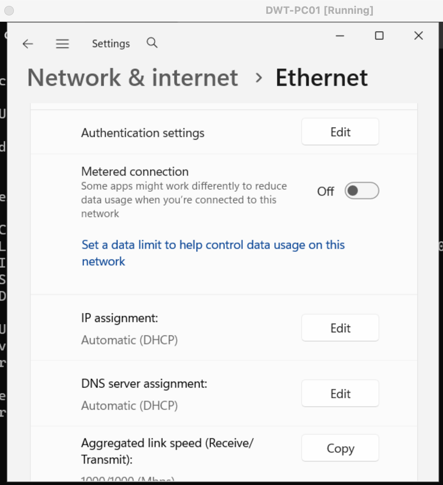

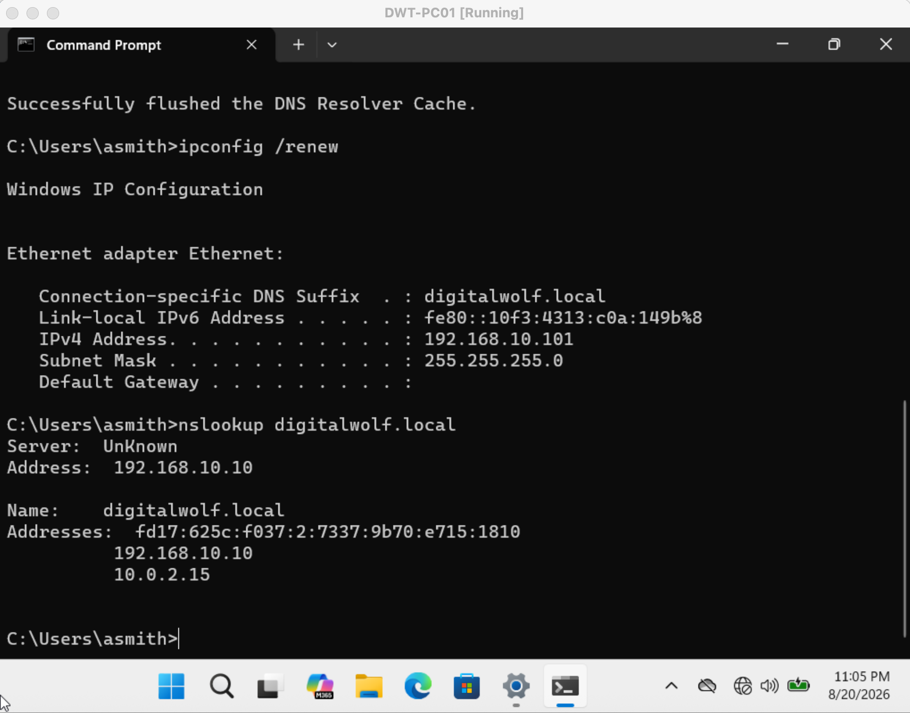

---

### DW-003 — Shared Folder Access

Investigated an Access Denied error and reviewed the permissions assigned to the shared resource.

#### Before

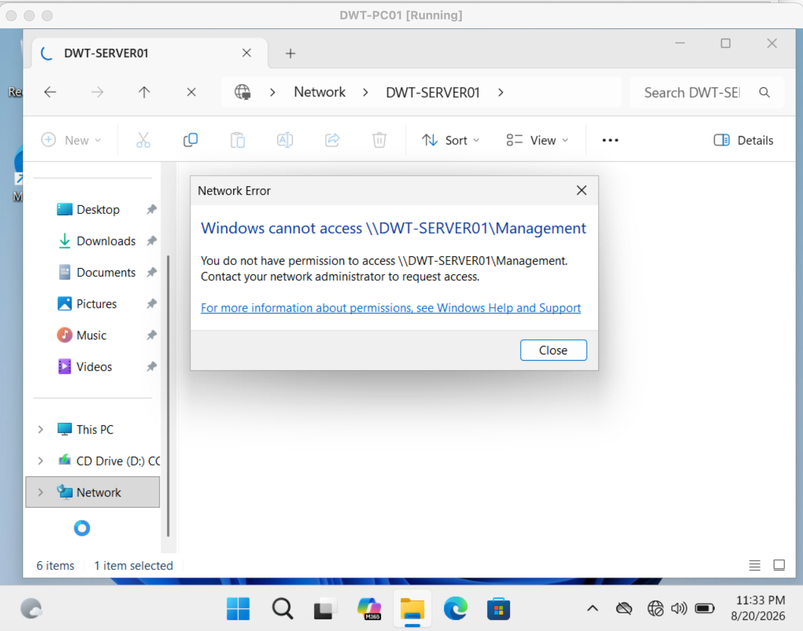

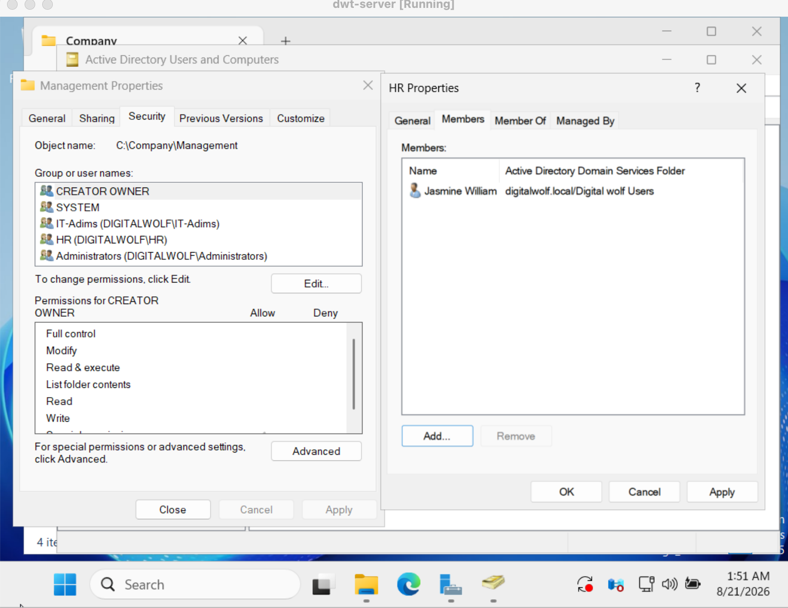

#### After

Updated the appropriate share permissions and verified that the user could access the resource.

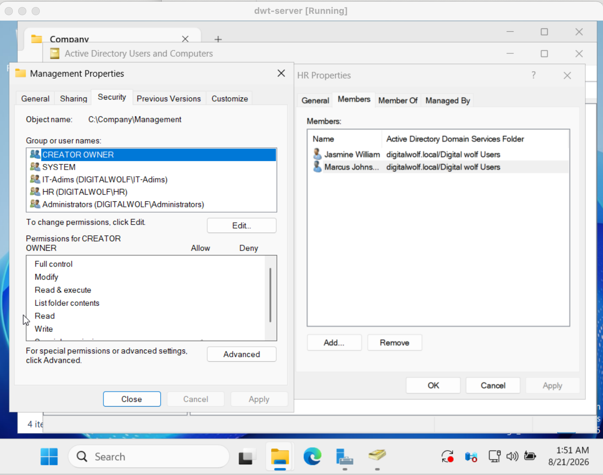

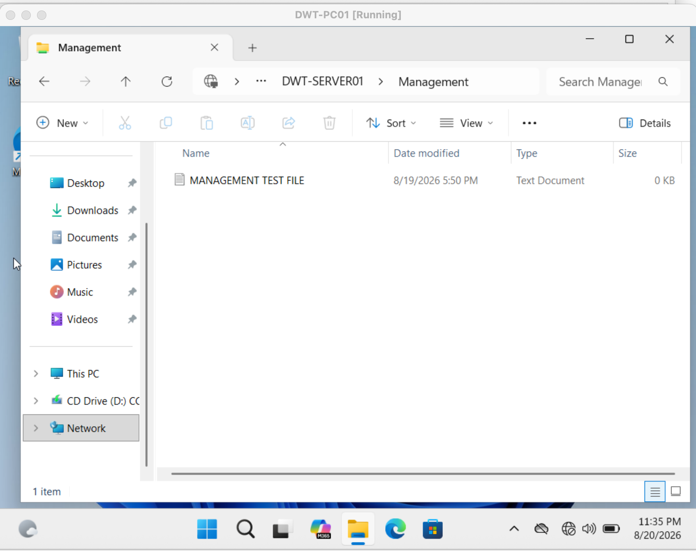

---

### DW-004 — Domain Login Failure

Investigated a domain login failure and verified the user account and authentication process.

#### Before

#### After

Verified the account and confirmed successful authentication.

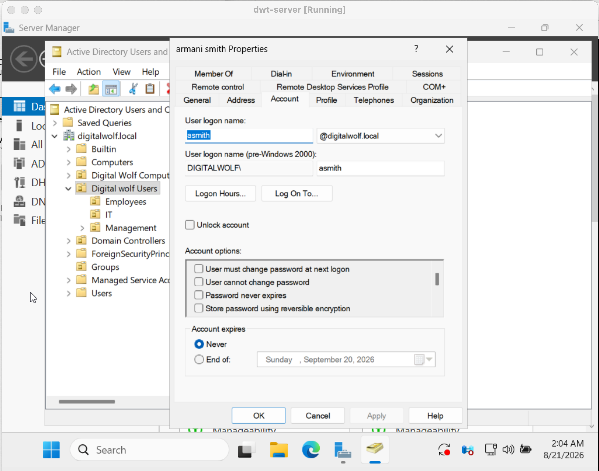

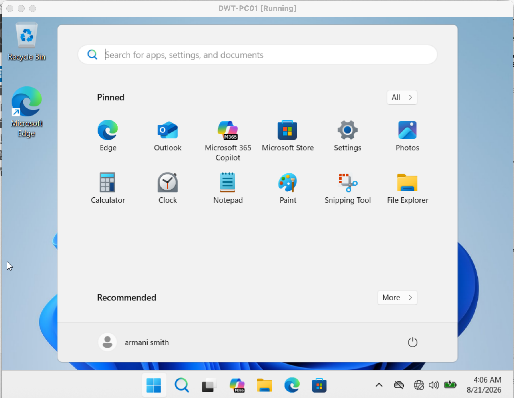

## Troubleshooting Workflow

For each ticket, I followed a structured troubleshooting process:

1. Identify the reported issue
2. Gather information
3. Reproduce or investigate the problem
4. Determine the root cause
5. Apply the appropriate fix
6. Test the solution
7. Document the resolution

## Key Takeaways

This portion of the project provided hands-on practice with common Help Desk issues involving networking, DNS, DHCP, permissions, Active Directory, and Windows authentication.

The troubleshooting process emphasized resolving the root cause rather than simply applying a temporary fix.
