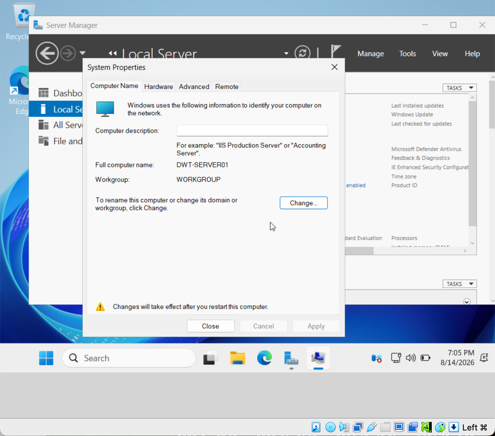
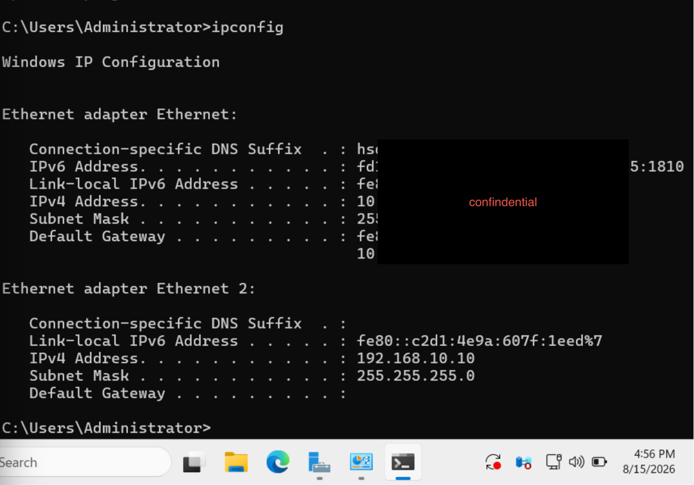
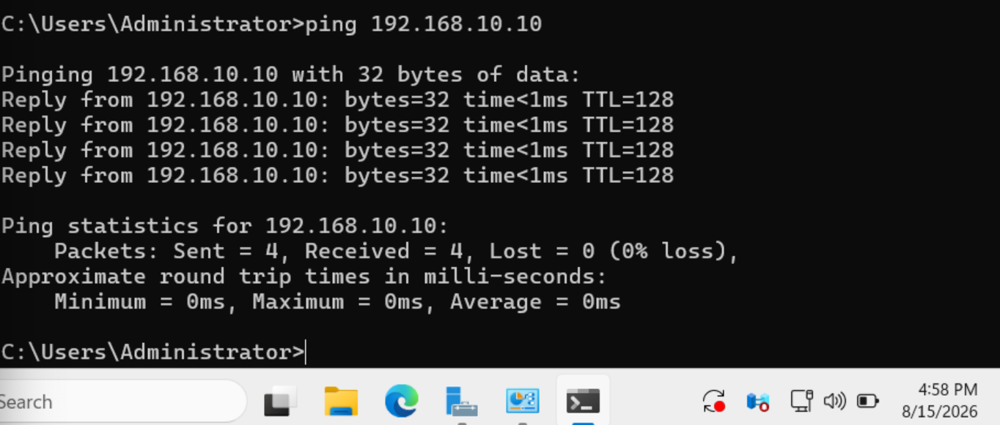

# Windows Server Configuration

## Overview

Windows Server was deployed as the primary infrastructure server for the Digital Wolf IT lab.

The server provides the centralized services required for the domain environment and Windows client management.

## Server Role

**Server:** DWT-SERVER01  
**Operating System:** Windows Server

## Services Configured

- Active Directory Domain Services (AD DS)
- DNS
- DHCP
- File Server
- Group Policy Management

## Configuration Tasks

- Installed Windows Server
- Configured the server name
- Configured network settings
- Installed required server roles
- Prepared the server for Active Directory
- Configured centralized network and domain services

## Skills Demonstrated

- Windows Server administration
- Server role installation
- Network configuration
- Infrastructure troubleshooting
- Windows administration

## Evidence
### Server Name
Configured the server with the hostname `DWT-SERVER01`.

### Static IP Configuration
Configured a static IP address for reliable infrastructure services.

### Network Connectivity Test
Verified network connectivity from the server.

