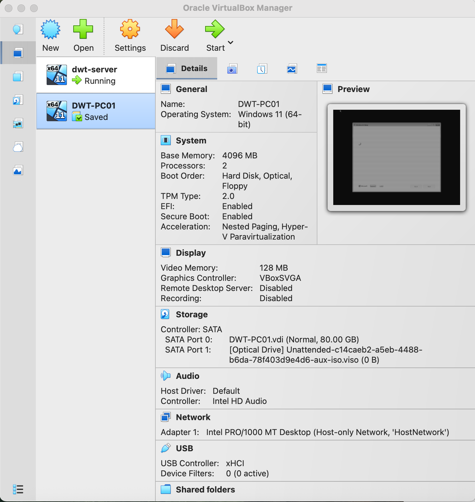
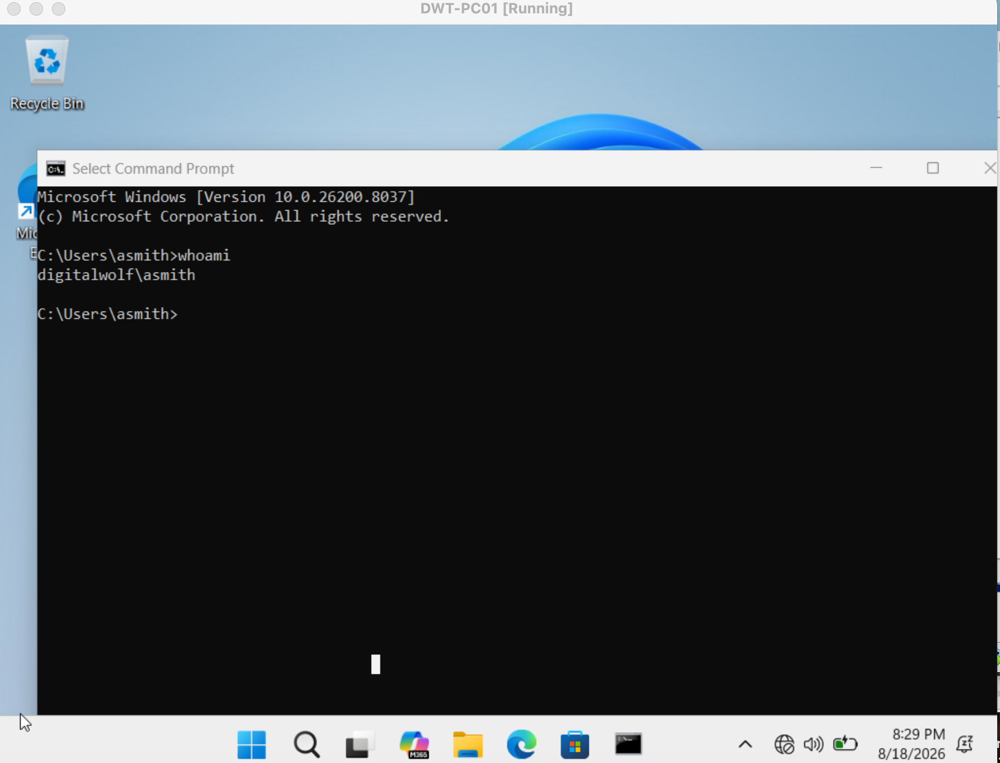
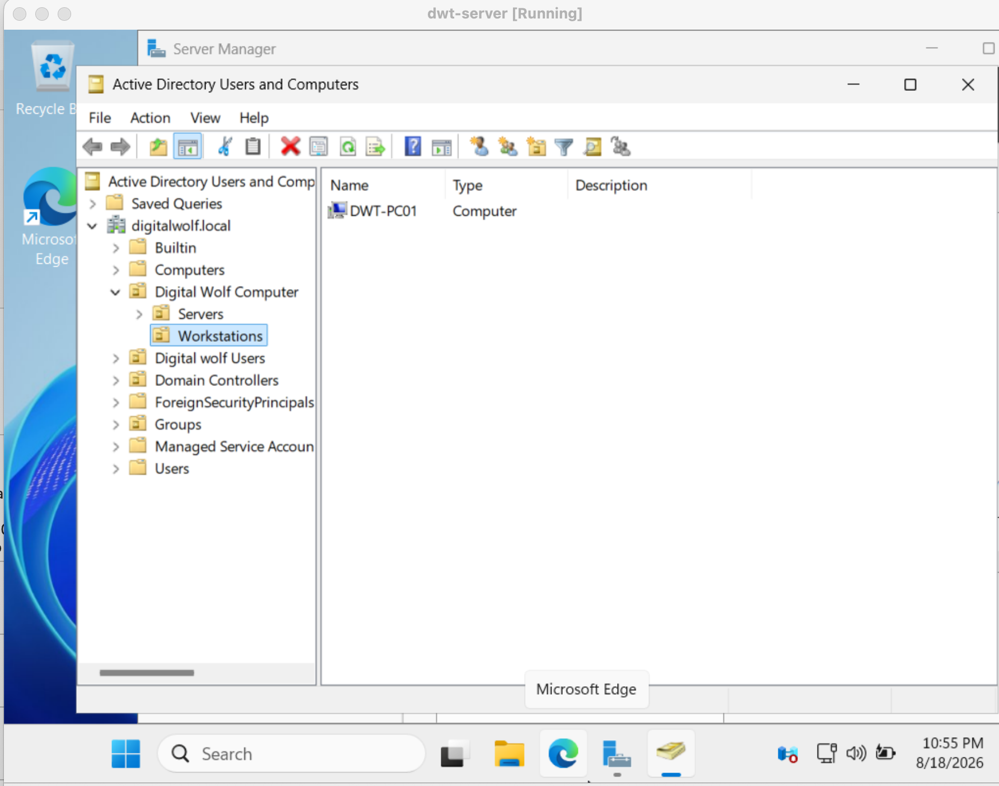

# Windows Client
## Overview
Configured a Windows 11 workstation to operate as a domain-joined client within the Digital Wolf IT lab.
## Client Configuration
Configured DWT-PC01 with the required system and network settings to communicate with the Windows Server infrastructure.
## Domain Join
Joined DWT-PC01 to the digitalwolf.local domain and verified that the domain join was successful.
## Active Directory Verification
Verified that DWT-PC01 appeared as a computer account in Active Directory after joining the domain.
### Skills Demonstrated
* Windows 11 configuration
* Network configuration
* Domain joining
* Active Directory computer management
* Domain authentication
* Windows troubleshooting
## Evidence
### 1. DWT-PC01 Configuration
Configured the Windows 11 workstation for the Digital Wolf domain environment.

### 2. Domain Join Success
Successfully joined DWT-PC01 to the digitalwolf.local domain.

### 3. DWT-PC01 Active Directory Computer Account
Verified that DWT-PC01 was created as a computer account in Active Directory.

